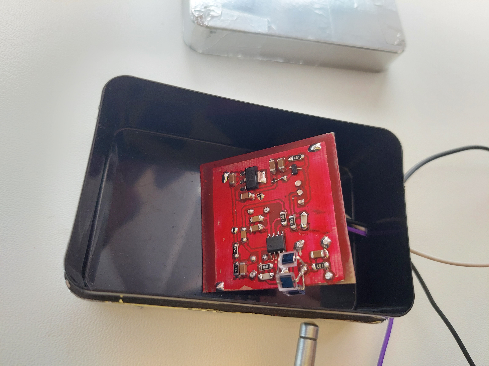
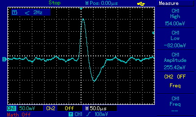

# MadRad
## My(maobuff) attempt at catching gamma photons.

# [Schemaic](doc/schematic.pdf)

# Remarks:
Increasing diode count doesn't improve sensitivity (TODO: check with comparator and counter).

Scintillator crystal is a MUST to improve sensitivity to be able to register natural radiation photons.

I highly recommend replacing BPW34 with a bigger diode with more surface area. For example, FirstSensor is manufacturing PIN diodes with a build-in scintillator.

Probably losing some gain to LMC662 bandwidth.

# What next?
```
Add a guard ring to the second stage on the PCB.
Improve sensitivity
Add comparator and counter
Sound or light effects
Improve SNR
Increase gain
Spectrometry
```

## Device assembled


## Output waveform example from Radium-226

